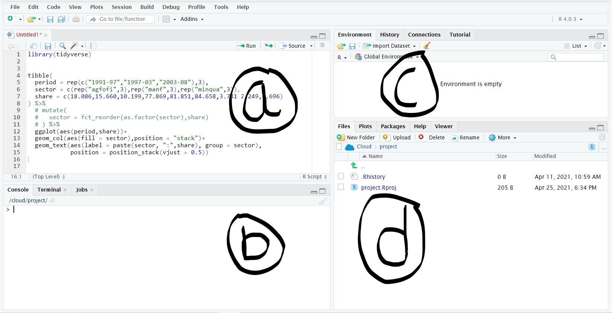

```{r setup, include=FALSE}
options(htmltools.dir.version = FALSE)
knitr::opts_chunk$set(
  fig.width=9, fig.height=3.5, fig.retina=3,
  out.width = "100%",
  cache = FALSE,
  echo = TRUE,
  message = FALSE, 
  warning = FALSE,
  fig.show = TRUE,
  hiline = TRUE
)
xaringanExtra::use_panelset()
library(palmerpenguins)
library(tidyverse)
library(kableExtra)
library(knitr)
library(flair)
```

```{r xaringan-themer, include=FALSE, warning=FALSE}
library(xaringanthemer)
style_duo_accent(
  primary_color = "#ccccff",
  secondary_color = "#FF961C",
  inverse_header_color = "#FFFFFF",
  title_slide_background_image = "images/background1.jpg",
  title_slide_text_color = "#ffffff"
)
```

```{r xaringanExtra,include=FALSE, warning=FALSE,}
xaringanExtra::use_xaringan_extra(c("clipboard",
                                    "fit_screen"))
xaringanExtra::use_extra_styles(hover_code_line = T,
                                mute_unhighlighted_code = T)

```

layout: true


---

name: Introduction

class: left,middle

.pull-left[

## Find me 

[__@ayushbipinpatel__](https://twitter.com/ayushbipinpatel)    
  
[__@AyushBipinPatel__](https://github.com/AyushBipinPatel) 
  
  
[__ayushpatel.netlify.app__](https://ayushpatel.netlify.app/)     
  
  
[__ayush.ap58@gmail.com__](ayush.ap58@gmail.com)<img src="data:image/svg+xml;base64,PD94bWwgdmVyc2lvbj0iMS4wIiBlbmNvZGluZz0iaXNvLTg4NTktMSI/Pg0KPCEtLSBHZW5lcmF0b3I6IEFkb2JlIElsbHVzdHJhdG9yIDE5LjAuMCwgU1ZHIEV4cG9ydCBQbHVnLUluIC4gU1ZHIFZlcnNpb246IDYuMDAgQnVpbGQgMCkgIC0tPg0KPHN2ZyB2ZXJzaW9uPSIxLjEiIGlkPSJDYXBhXzEiIHhtbG5zPSJodHRwOi8vd3d3LnczLm9yZy8yMDAwL3N2ZyIgeG1sbnM6eGxpbms9Imh0dHA6Ly93d3cudzMub3JnLzE5OTkveGxpbmsiIHg9IjBweCIgeT0iMHB4Ig0KCSB2aWV3Qm94PSIwIDAgNTExLjk3NCA1MTEuOTc0IiBzdHlsZT0iZW5hYmxlLWJhY2tncm91bmQ6bmV3IDAgMCA1MTEuOTc0IDUxMS45NzQ7IiB4bWw6c3BhY2U9InByZXNlcnZlIj4NCjxnPg0KCTxnPg0KCQk8Zz4NCgkJCTxwYXRoIGQ9Ik01MTEuODcyLDE5NS43MjVjLTAuMDUzLTAuNTg4LTAuMTctMS4xNjktMC4zNS0xLjczMmMtMC4xMTctMC41MDMtMC4yOC0wLjk5NC0wLjQ4Ni0xLjQ2OA0KCQkJCWMtMC4yMzktMC40NjMtMC41MjUtMC45MDEtMC44NTMtMS4zMDZjLTAuMzI5LTAuNDgxLTAuNzEtMC45MjQtMS4xMzUtMS4zMjNjLTAuMTM3LTAuMTE5LTAuMTk2LTAuMjgyLTAuMzQxLTAuNDAxDQoJCQkJbC04Mi4wNjUtNjMuNzM1VjU5LjcwNGMwLTE0LjEzOC0xMS40NjItMjUuNi0yNS42LTI1LjZoLTkyLjQ3NkwyNzEuNTM5LDUuMzU1Yy05LjE0Ny03LjEzNC0yMS45NzQtNy4xMzQtMzEuMTIxLDANCgkJCQlsLTM3LjAzNSwyOC43NDloLTkyLjQ3NmMtMTQuMTM4LDAtMjUuNiwxMS40NjEtMjUuNiwyNS42djY2LjA1N0wzLjI2OCwxODkuNDk2Yy0wLjE0NSwwLjEyLTAuMjA1LDAuMjgyLTAuMzQxLDAuNDAxDQoJCQkJYy0wLjQyNSwwLjM5OC0wLjgwNiwwLjg0Mi0xLjEzNSwxLjMyM2MtMC4zMjgsMC40MDUtMC42MTQsMC44NDItMC44NTMsMS4zMDZjLTAuMjA3LDAuNDczLTAuMzY5LDAuOTY1LTAuNDg2LDEuNDY4DQoJCQkJYy0wLjE3OCwwLjU1NS0wLjI5NSwxLjEyNy0wLjM1LDEuNzA3YzAsMC4xNzktMC4xMDIsMC4zMzMtMC4xMDIsMC41MTJWNDg2LjM3YzAuMDEyLDUuNDI4LDEuNzY4LDEwLjcwOCw1LjAwOSwxNS4wNjENCgkJCQljMC4wNTEsMC4wNzcsMC4wNiwwLjE3MSwwLjExOSwwLjIzOWMwLjA2LDAuMDY4LDAuMTg4LDAuMTQ1LDAuMjczLDAuMjM5YzQuNzk0LDYuMzA4LDEyLjI1LDEwLjAyNywyMC4xNzMsMTAuMDYxaDQ2MC44DQoJCQkJYzcuOTU0LTAuMDI0LDE1LjQ0MS0zLjc2MSwyMC4yNDEtMTAuMTAzYzAuMDY4LTAuMDg1LDAuMTcxLTAuMTExLDAuMjMtMC4xOTZjMC4wNi0wLjA4NSwwLjA2OC0wLjE2MiwwLjEyLTAuMjM5DQoJCQkJYzMuMjQxLTQuMzU0LDQuOTk3LTkuNjM0LDUuMDA5LTE1LjA2MVYxOTYuMjM3QzUxMS45NzQsMTk2LjA1OCw1MTEuODgxLDE5NS45MDQsNTExLjg3MiwxOTUuNzI1eiBNMjUwLjg1NCwxOC44Mg0KCQkJCWMyLjk4LTIuMzY4LDcuMi0yLjM2OCwxMC4xOCwwbDE5LjY4NiwxNS4yODNoLTQ5LjQ5M0wyNTAuODU0LDE4LjgyeiBNMjcuNzI1LDQ5NC45MDRsMjIzLjEzLTE3My4zMjENCgkJCQljMi45ODItMi4zNjQsNy4xOTktMi4zNjQsMTAuMTgsMGwyMjMuMTg5LDE3My4zMjFIMjcuNzI1eiBNNDk0LjkwOCw0ODEuNkwyNzEuNTM5LDMwOC4xMTdjLTkuMTQ5LTcuMTI4LTIxLjk3Mi03LjEyOC0zMS4xMjEsMA0KCQkJCUwxNy4wNDEsNDgxLjZWMjA5LjIzM0wxNTYuODc3LDMxNy44MmMzLjcyNiwyLjg4OSw5LjA4OCwyLjIxMSwxMS45NzctMS41MTVjMi44ODktMy43MjYsMi4yMTEtOS4wODgtMS41MTUtMTEuOTc3DQoJCQkJTDI1LjI3NiwxOTQuMDE4bDYwLjAzMi00Ni42NTJ2NjUuOTM3YzAsNC43MTMsMy44MjEsOC41MzMsOC41MzMsOC41MzNjNC43MTMsMCw4LjUzMy0zLjgyMSw4LjUzMy04LjUzM3YtMTUzLjYNCgkJCQljMC00LjcxMywzLjgyLTguNTMzLDguNTMzLTguNTMzaDI5MC4xMzNjNC43MTMsMCw4LjUzMywzLjgyLDguNTMzLDguNTMzdjE1My42YzAsNC43MTMsMy44Miw4LjUzMyw4LjUzMyw4LjUzMw0KCQkJCXM4LjUzMy0zLjgyMSw4LjUzMy04LjUzM3YtNjUuOTM3bDYwLjAzMiw0Ni42NTJsLTE0Mi4zMSwxMTAuNTA3Yy0yLjQ0OCwxLjg1NS0zLjcxMSw0Ljg4My0zLjMwNSw3LjkyOHMyLjQxNyw1LjYzNyw1LjI2Niw2Ljc4Ng0KCQkJCWMyLjg0OSwxLjE0OSw2LjA5NiwwLjY3OSw4LjUwMS0xLjIzMmwxNDAuMDgzLTEwOC43NzRWNDgxLjZ6Ii8+DQoJCQk8cGF0aCBkPSJNMzU4LjM3NCwyMDQuNzd2LTM0LjEzM2MwLTU2LjU1NC00NS44NDYtMTAyLjQtMTAyLjQtMTAyLjRjLTU2LjU1NCwwLTEwMi40LDQ1Ljg0Ni0xMDIuNCwxMDIuNA0KCQkJCXM0NS44NDYsMTAyLjQsMTAyLjQsMTAyLjRjNC43MTMsMCw4LjUzMy0zLjgyLDguNTMzLTguNTMzcy0zLjgyLTguNTMzLTguNTMzLTguNTMzYy00Ny4xMjgsMC04NS4zMzMtMzguMjA1LTg1LjMzMy04NS4zMzMNCgkJCQlzMzguMjA1LTg1LjMzMyw4NS4zMzMtODUuMzMzczg1LjMzMywzOC4yMDUsODUuMzMzLDg1LjMzM3YzNC4xMzNjMCw5LjQyNi03LjY0MSwxNy4wNjctMTcuMDY3LDE3LjA2Nw0KCQkJCXMtMTcuMDY3LTcuNjQxLTE3LjA2Ny0xNy4wNjd2LTM0LjEzM2MwLTQuNzEzLTMuODItOC41MzMtOC41MzMtOC41MzNzLTguNTMzLDMuODItOC41MzMsOC41MzMNCgkJCQljMCwxOC44NTEtMTUuMjgyLDM0LjEzMy0zNC4xMzMsMzQuMTMzYy0xOC44NTEsMC0zNC4xMzMtMTUuMjgyLTM0LjEzMy0zNC4xMzNzMTUuMjgyLTM0LjEzMywzNC4xMzMtMzQuMTMzDQoJCQkJYzQuNzEzLDAsOC41MzMtMy44Miw4LjUzMy04LjUzM3MtMy44Mi04LjUzMy04LjUzMy04LjUzM2MtMjIuOTE1LTAuMDUxLTQzLjA3NCwxNS4xMy00OS4zNTQsMzcuMTY4DQoJCQkJYy02LjI4LDIyLjAzOCwyLjg0Nyw0NS41NjUsMjIuMzQ3LDU3LjYwMWMxOS41LDEyLjAzNiw0NC42MjIsOS42NSw2MS41MDctNS44NDNjMS44NTgsMTguMDQ2LDE3LjU0MywzMS40NjQsMzUuNjU5LDMwLjUwNQ0KCQkJCUMzNDQuMjUsMjM3LjkxLDM1OC40MzEsMjIyLjkxMiwzNTguMzc0LDIwNC43N3oiLz4NCgkJPC9nPg0KCTwvZz4NCjwvZz4NCjxnPg0KPC9nPg0KPGc+DQo8L2c+DQo8Zz4NCjwvZz4NCjxnPg0KPC9nPg0KPGc+DQo8L2c+DQo8Zz4NCjwvZz4NCjxnPg0KPC9nPg0KPGc+DQo8L2c+DQo8Zz4NCjwvZz4NCjxnPg0KPC9nPg0KPGc+DQo8L2c+DQo8Zz4NCjwvZz4NCjxnPg0KPC9nPg0KPGc+DQo8L2c+DQo8Zz4NCjwvZz4NCjwvc3ZnPg0K" width=5%>  

]

.pull-right[


.small[
Image: [John Biglin in a Single Scull by Thomas Eakins](https://images.metmuseum.org/CRDImages/ad/original/57258.jpg)
]

]
---

class: left, middle

.pull-left[

#  Pre-requisite

.big[You....]

<br>


have __some experience in working with data__. _You need not necessarily know how to use a fancy tool._
<br>


want to __learn how to use R for data analysis.__ _Knowing how to use programming language is not required_
<br>


have __basic training in statistics__. _This means you know the basic concepts in statistics (undergrad level)._
<br>


]

.pull-right[


.small[
[Image:  Lake George by John Frederick Kensett ](https://images.metmuseum.org/CRDImages/ad/original/DT84.jpg)
]
]
---
class: middle

# What is R and RStudio?

.pull-left[

<br><br>
A programming language.<br><br>
A tool for statistical analysis.<br><br>


]

.pull-right[

<br><br>
An Integrated Development Environment.<br><br>
A tool to access R and produce various kinds of outputs such as analysis reports.<br><br>
<br>
.tiny[Photo by Charlotte May from Pexels]
]

---

## Using RStudio



???

explain what a,b,c,d. Demonstrate use.

show how to create a project
show how to run a command
show how to create a new file
show how to save a new file

---

## Running some basic commands

.yscroll[
.panelset[

.panel[.panel-name[R - a calculator]

```{r}
2+2
```


```{r}
2*5
```

]

.panel[.panel-name[Comparing Values]

```{r}
5 > 5

2^5 < 4025

"ayush" == "ayush" ## Notice any thing ?

(5 > 4) & (5 > 6)

(5 > 4) | (5 > 6)

```


]

.panel[.panel-name[Storing Inforamtion]

```{r}
# Assigning values

a <- 5

6 -> b

c = 10

d <- "will this guy even teach us the good stuff?"

a
b
c
d
```


]

.panel[.panel-name[Why this silly exercise]

### To impress upon you that ...

1) Mathematical commands in R are written in .small[almost] the same way as you would write in a piece of paper.

2) =  and == are .big[not the same] thing.

3) Values/information can be stored. These things that store values can be given names you like. These are called objects.

4) <- or -> or = can be used to store information/values. .big[Please use <- or ->].

]

]
]

---

## Activity 1 

```{r time1, echo=FALSE}
countdown::countdown(minutes = 3,play_sound = T,top = 0)
```

.yscroll[

.left-column[
<iframe src="https://giphy.com/embed/26n60zk988k2wFoSk" width="480" height="369" frameBorder="0" class="giphy-embed" allowFullScreen></iframe><p><a href="https://giphy.com/gifs/sholay-gabbar-singh-amjad-khan-26n60zk988k2wFoSk">via GIPHY</a></p>
]

.right-column[
.big[Copy the code on the screen.] Follow the instructions and complete this code.


```{r eval=FALSE}
# Store our name in the object called "name"
name <- 

# create an object that stores your birth year in YYYY format,
# name it "y_birth"
 
   
# Run this line of code after you have completed the above two lines of code

message(
  if(1975>y_birth){
    paste(1975-y_birth,"years after you were born, the film Sholya was released",
          sep = " ")
  }else{
    paste(
      "Sholay was released",
      y_birth - 1975,
      "years before you were born."
    )
  }
)
    
```

]
]

---

class: top, left

## Object: A brief overview

.left-column[

An object has a name (given by the programmer, usually).

Objects are used to store information (data).

Objects are of various types.

Data/information within the object can be changed or updated

]

.yscroll[
.right-column[


.panelset[

.panel[.panel-name[The Assignment Operator]


`<-` or `->` are used to assign values to Object.
<br>

`=` works as well, I prefer `->` or `<-`

```{r assign}
a <- 2
b <- "Ayush"
c(1,25,53,5) -> obj
a
b
obj
```


]
.panel[.panel-name[Object Class]

```{r obj_class}
class(a)
class(b)
class(obj)
```


]
.panel[.panel-name[Different Kinds]

A vector (the objects a, b, obj)

A data frame

A list

```{r lis}
# A list
list(a,b,obj,penguins) -> ex_list
ex_list
```

```{r eval=FALSE}
# A data frame
penguins
```

```{r echo=FALSE}
penguins %>%
knitr::kable()%>%
kableExtra::kable_styling()%>%
scroll_box(width = "100%", height = "400px")
```


]

]
]
]

---

# Creating Objects

.yscroll[

.panelset[

.panel[.panel-name[An atomic vector]

Such objects can be created by using the .big[`c()`] function.

```{r}
c(1,2,3,8,6)

fictional_characters <- c("Thor", "Gimli", "Frodo")

fictional_characters
```

These kind of objects are .big[homogeneous]. .small[What does that even mean??]

```{r }
info_store1 <- c("ayush", 854, "hello")


info_store2 <- c("ayush", "854", "hello")

info_store1

info_store2
```


]

.panel[.panel-name[A data frame]

A data-frame, by it self, .big[can have values that are of different types], i.e. numeric, character, date, etc...

.big[But], the columns (vectors) that make a data frame are homogeneous.

.pull-left[
Base R approach
```{r}
data.frame(
  movie = c("Sholay", "LoTR", "Lathe Joshi"),
  year_release = c(1975,2001,2016)
) -> obj1

obj1
```

]

.pull-right[
tidy approach
```{r}
tibble(
  movie = c("Sholay", "LoTR", "Lathe Joshi"),
  year_release = c(1975,2001,2016)
)-> obj2

obj2
```

]

]


.panel[.panel-name[A list]

Lists are created using the .big[`list()`] functions.

These are .big[heterogeneous] objects

```{r}
collected_info <- list(fictional_characters, "Ayush", c(32,5,4), obj2)

collected_info
```


]

]
]
---

# Subsetting objects

.left-column[
<iframe src="https://giphy.com/embed/PlnQNcQ4RYOhG" width="480" height="480" frameBorder="0" class="giphy-embed" allowFullScreen></iframe><p><a href="https://giphy.com/gifs/experience-jenga-PlnQNcQ4RYOhG">via GIPHY</a></p>
]

.right-column[

### There can be three ways to get desired parts of an object

.big[One] - by referring to the exact .big[place or position] within an object.

.big[Second] - by using the .big[name of the part] you want to access.

.big[Three] - by providing a .big[condition] to access only those parts that fulfill this condition.

]

---

# Subsetting an atomic vector

.yscroll[


.panelset[

.panel[.panel-name[data]

```{r include=FALSE}
random_number <- rnorm(50,25,7)

month_names <- month.name
```

```{r}
random_number

month_names
```

]

.panel[.panel-name[by position]

```{r}
random_number[1]

random_number[c(1,5,8)]

month_names[-5]

month_names[-c(1,10)]
```


]

.panel[.panel-name[using a condition]

```{r}
random_number[random_number>20]

month_names[month_names == "June"]
```


]


]

]
---

# Subsetting a data frame

.yscroll[


.panelset[

.panel[.panel-name[data]

```{r echo=FALSE}
penguins %>%
knitr::kable()%>%
kableExtra::kable_styling()%>%
scroll_box(width = "100%", height = "400px")

```

]

.panel[.panel-name[by position]

```{r}
penguins[5,7]

penguins[c(1,3),c(2,8)]
```


]

.panel[.panel-name[using a condition]

```{r}
names(penguins) # Also, this function gives us all the column names in a data frame
```

```{r}
penguins$bill_length_mm # the '$' operator allows us to select a column of the data frame
```

```{r}
penguins[penguins$body_mass_g >4000,c("bill_length_mm", "year")]
```


]


]

]
---

# Subsetting a list

.yscroll[


.panelset[

.panel[.panel-name[data]

```{r echo=FALSE}
list_obj <- list(fictional_characters,random_number,obj1,penguins)

```

```{r}
list_obj
```


]

.panel[.panel-name[by position]

```{r}
list_obj[1]

list_obj[[1]]

typeof(list_obj[1])

typeof(list_obj[[1]]) # What do you see?
```

```{r}
list_obj[[4]][c(1:10),c(1:5)] # Notice anything??
```


]

.panel[.panel-name[using a condition]

```{r}
list_obj[[2]][list_obj[[2]]>15]
```


]


]

]
---

# Activity 2

```{r time2, echo=FALSE}
countdown::countdown(minutes = 7,play_sound = T,top = 0)
```

.yscroll[

.big[Copy and execute the following code.]

```{r eval=FALSE}
install.packages("palmerpenguins") # dont run this if already installed

library(palmerpenguins) # dont run if already loaded
```


```{r}
collected_data <- list(
  rnorm(25,51,6.5),
  month.abb,
  penguins
)
```

.big[Write code to ....]

1> call the object `collected_data`

2> Subset only those values from the first element of the list `collected_data` that are greater than 18

3> Subset the list `collected_data` so that you get only those observations where the penguin is of the species gentoo and weighs more than 3800
]

---

class: top, left

# The Missing value 

.yscroll[

.left-column[

<iframe src="https://giphy.com/embed/26hkhPJ5hmdD87HYA" width="480" height="480" frameBorder="0" class="giphy-embed" allowFullScreen></iframe><p><a href="https://giphy.com/gifs/kitchen-looney-tunes-empty-26hkhPJ5hmdD87HYA">via GIPHY</a></p>

]


.right-column[

.panelset[

.panel[.panel-name[What?]

.center[An experiment where people are asked time exactly at noon and record the answers. Interest is to find variance of the observations.]

.left-column[
<iframe src="https://giphy.com/embed/MeQ0kQLyqWL5XOsNf7" width="480" height="100" frameBorder="0" class="giphy-embed" allowFullScreen></iframe><p><a href="https://giphy.com/gifs/animation-conversation-elifdemir-MeQ0kQLyqWL5XOsNf7">via GIPHY</a></p>
]

.right-column[
_Person A:_ Hey! Could you tell me What is the time?
<br>
_Person B:_ Sorry! I am not wearing a watch or carrying my phone.
]

.center[
_Person A at their home records the answers_ 
]
<br>
<br>
```
12:00, 12:05, 12:10, 11:50, ----, 12:01, 12:09,.......
0,5,10,-10,----,1,9,.......
```

```{r}
c(0,5,10,-10,NA,1,9)
```

<br>
<br>
]

.panel[.panel-name[How to identify]
<iframe src="https://giphy.com/embed/26DMUXQypGJaHhTsQ" width="480" height="260" frameBorder="0" class="giphy-embed" allowFullScreen></iframe><p><a href="https://giphy.com/gifs/scoobydoo-cartoon-scooby-26DMUXQypGJaHhTsQ">via GIPHY</a></p>

Using the function `is.na()`.

Returns `TRUE` or `FALSE` depending the value in an object.

```{r}
is.na(NA)
is.na(c(0,5,10,-10,NA,1,9))
a <- c("ayush","saswata","piyush", NA)
is.na(a)
```

<br>
<br>
<br>
]

.panel[.panel-name[Troublemaker]

<iframe src="https://giphy.com/embed/26CaMOXjjDM3Xl2s8" width="480" height="360" frameBorder="0" class="giphy-embed" allowFullScreen></iframe><p><a href="https://giphy.com/gifs/cartoon-looney-tunes-26CaMOXjjDM3Xl2s8">via GIPHY</a></p>


Not considering NAs in your data can generate erroneous results

<br>
```{r}
5+ NA
c(1,2,3,5,8,6,NA,2,58) -> vals
vals + 1
vals - 1
vals * 2
```

<br>
<br>

]

]

]

]


---

# Functions

.big[What is it?]

  + A fixed set of operation or commands. All these commands get executed if the _function is called_.

  + Expects specific types of inputs, .small[usually], to generate outputs. These inputs are refered to as _arguments_

  + Has a name. Using this name a function can be called.

  + You can make your own functions too. .small[We shall revisit this topic]
  
  + Functions are objects.


---

# Functions

.yscroll[

.big[Why Use Functions ??!]


.center[No need to copy and paste code again and again.]<br>
.center[Less chances of errors due to reduced copy paste.]<br>
.center[Easier to maintain or update]<br>

.pull-left[
.center[Not using a function]<br><iframe src="https://giphy.com/embed/l0HUbCY5FyDDTCire" width="480" height="336" frameBorder="0" class="giphy-embed" allowFullScreen></iframe><p><a href="https://giphy.com/gifs/archivesontario-axe-archivesgif-l0HUbCY5FyDDTCire">via GIPHY</a></p>
] 

.pull-right[
.center[Using a function]<br><iframe src="https://giphy.com/embed/lkhfMijDDuSQM" width="480" height="360" frameBorder="0" class="giphy-embed" allowFullScreen></iframe><p><a href="https://giphy.com/gifs/machine-wood-cutting-lkhfMijDDuSQM">via GIPHY</a></p>
]

<br>


]

---

class: top, left

## Functions - the essentials

.yscroll[
.panelset[

.panel[.panel-name[How to use]

```{r fun_ex, include=FALSE}
c(1,2,3,5.5,7,5,2,3,NA) -> a
c("ayush","dobby","Gimli") -> b
list(a,b) -> store_list
length(a)
length(store_list)
```

```{r echo=FALSE}
decorate("fun_ex") %>% 
  flair_funs() %>% 
  flair_rx(pattern = "(?<=\\().+(?=\\))",
        background = "LIghtCyan") %>%
  flair("(", color = "Crimson") %>% 
  flair(")", color = "Crimson") %>% 
  flair(",", color = "Crimson") %>% 
  knit_print.with_flair()
```


]

.panel[.panel-name[Essential functions]

### Length

```{r}
length(a)
length(b)
```

### Unique

```{r}
unique(b)
```


### Mean/Median

```{r}
mean(a)
mean(a, na.rm = T)
median(a, na.rm = T)
```

### Sum

```{r}
sum(a)
sum(a, na.rm = TRUE)
```

### Ifelse

```{r}
ifelse(
  a > 3,
  "Greater than 3",
  "Not Greater than 3"
)
ifelse(
  a > 3,
  a - 1,
  a*0
)
```

### names

```{r}
names(penguins)
```

### View

```{r eval=FALSE}
View(penguins)
```

```{r echo=FALSE}
penguins %>%
knitr::kable()%>%
kableExtra::kable_styling()%>%
scroll_box(width = "100%", height = "400px")
```

### dim

```{r}
dim(penguins)
```


<br>

<br>
<br>

]

]
]
---

# Activity 3

```{r time3, echo=FALSE}
countdown::countdown(minutes = 10,play_sound = T,top = 0)
```

.big[Write code to get]

1) The mean of the first element of the list `collected_data`

2) The number of rows of the third element of the object `collected_data`

3) The all the unique values the variable `species` can take 

4) The length of the second element of the list `collected data`

5) view the penguins data from the object `collected_Data`

---

class: center, middle

background-image: url("images/background2.jpg")
background-size: cover

